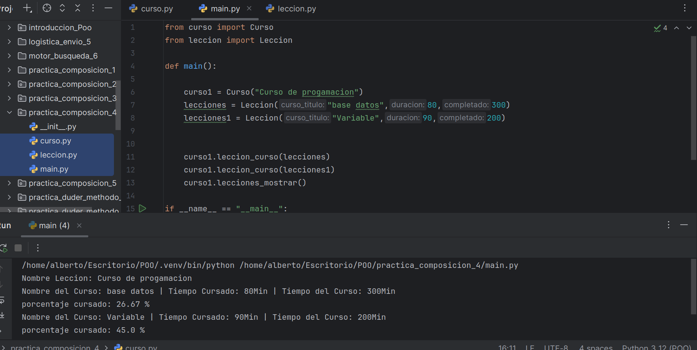

# Programa con Metodo de Composicion

## ¿Como esta hecho?

El programa esta hecho con un metodo llamado composicion en Progracion Orientada Objeto

## ¿Que hace el programa?

Nos muestra cuando ejecutamos o inicializamos el tiempo que hemos cursado y que porcentaje llevamos cursado

## Hecho por AlbertoDev28
 
## # ¿Quién soy?
Soy Alberto Montero [este mi url en github](https://github.com/AlbertoDev28)

## Imagen de la ejecucion del programa

